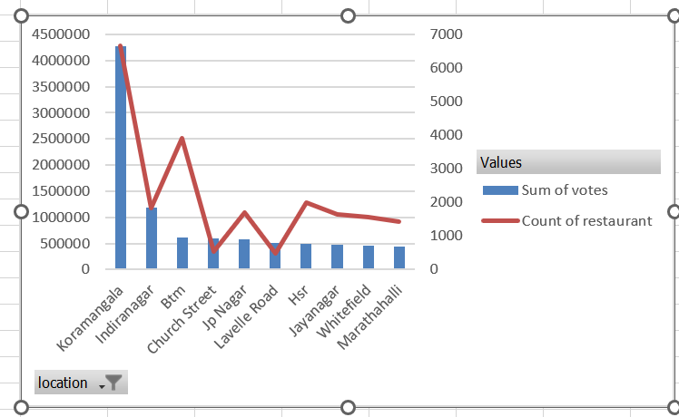
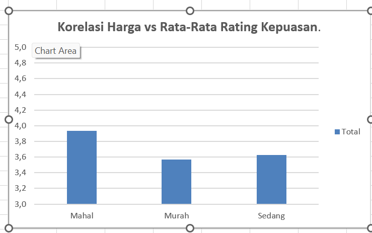
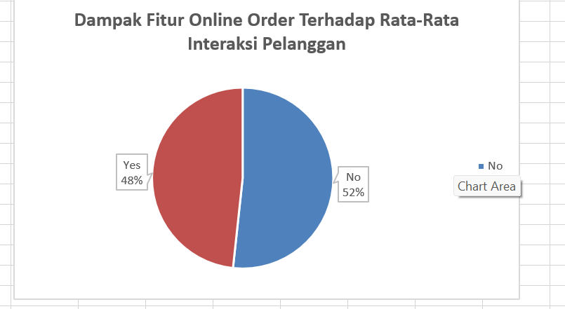

# 🍽️ Zomato Bangalore F&B Market Analysis


> **Ringkasan Eksekutif:** Proyek ini mengolah lebih dari 51.000 data restoran Zomato di Bangalore untuk memetakan pola pasar, tren harga, dan area paling strategis. Melalui proyek ini, data mentah dibersihkan dan diubah menjadi wawasan bisnis (*business insights*) yang siap digunakan oleh manajemen atau investor untuk mengambil keputusan berbasis data.
> 
> 📄 **Sumber Data:** Dataset publik yang digunakan dalam analisis ini bersumber dari [Kaggle - Zomato Bangalore Restaurants](https://www.kaggle.com/datasets/himanshupoddar/zomato-bangalore-restaurants).

---

## 🔁 Alur Kerja Proyek (End-to-End Pipeline)

Proyek ini dikerjakan dengan alur yang sistematis dari pengolahan data mentah hingga menjadi laporan akhir yang siap pakai, terbagi menjadi 3 tahapan utama:

### 1. Pembersihan Data Menyeluruh (Data Cleansing Pipeline)
Data mentah dari lapangan memiliki banyak ketidaksempurnaan yang dapat membuat analisis menjadi bias. Tahap ini memastikan data benar-benar bersih dan valid melalui beberapa langkah:
* **Penanganan Data Duplikat & Penyaringan Kolom:** Mendeteksi dan menghapus baris data yang ganda serta mengeliminasi kolom yang tidak relevan agar proses komputasi lebih cepat dan akurat.
* **Standarisasi Teks & Karakter:** Merapikan penulisan teks yang berantakan (seperti menghapus spasi berlebih, menyamakan huruf besar-kecil pada nama lokasi, dan membersihkan simbol) agar data menjadi seragam dan konsisten.
* **Penanganan Data Kosong (Missing Values) secara Spesifik:** Tidak semua data kosong diperlakukan sama. Untuk kolom angka tertentu, saya menggunakan nilai tengah (*median*) agar tidak merusak distribusi asli akibat nilai ekstrem (*outliers*), sementara untuk kolom lainnya diterapkan metode penyesuaian khusus yang sesuai dengan karakteristik datanya.

### 2. Pembuatan Metrik Bisnis (Feature Engineering)
Untuk mendapatkan analisis yang lebih tajam, saya menciptakan indikator bisnis baru berdasarkan data yang ada:
* Mengelompokkan skala harga restoran ke dalam 3 segmen yang proporsional (Murah, Sedang, Mahal).
* Merumuskan **Skor Popularitas**—sebuah metrik khusus yang menggabungkan tingkat kepuasan (*rating*) dengan seberapa aktif pelanggan berinteraksi (jumlah *votes*).

### 3. Ekstraksi & Visualisasi Tren Bisnis
Data yang sudah matang kemudian dikelompokkan dan dihitung rata-ratanya berdasarkan variabel tertentu (seperti lokasi dan status online) untuk menjawab tantangan bisnis. Hasil akhir diekspor ke Microsoft Excel untuk dibuatkan grafik visual agar mudah dipahami oleh tim non-teknis.

---

> ### 💡 PEMBERITAHUAN UNTUK RECRUITER & ASSESSOR
> Seluruh alur proses pembersihan data (*cleansing*), manipulasi, hingga pemodelan metrik bisnis di atas dieksekusi secara otomatis menggunakan *pipeline* Python yang terstruktur dari awal hingga akhir. Anda dapat mengakses dan meninjau seluruh kode pemrograman aslinya di dalam file **[`Notebook/Afif Febrian_Restaurant.ipynb`](Notebook/Afif%20Febrian_Restaurant.ipynb)**.

---

## 📌 Temuan Bisnis Utama (Key Findings)

### 1. Lokasi Paling Strategis untuk Ekspansi
**Koramangala** adalah episentrum pasar F&B di Bangalore, mencetak lebih dari **4,2 juta interaksi pelanggan**. Area ini sangat direkomendasikan sebagai target utama jika perusahaan atau investor ingin membuka cabang baru karena pasarnya sudah terbukti sangat aktif.
<br>

### 2. Strategi Harga vs Kepuasan Pelanggan
Harga murah ternyata bukan jaminan pelanggan akan puas. Restoran di kategori harga **"Mahal"** justru secara konsisten meraih rata-rata *rating* tertinggi (3.93/5). Ini membuktikan bahwa pelanggan di Bangalore sangat memprioritaskan kualitas dan pengalaman premium dibandingkan sekadar harga murah.
<br>

### 3. Pentingnya Transformasi Digital
Integrasi layanan digital adalah sebuah keharusan. Restoran yang menyediakan layanan **Pemesanan Online** mencatatkan Skor Popularitas yang jauh lebih tinggi (17.55) dibandingkan restoran yang hanya melayani makan di tempat secara tradisional (15.63).
<br>

---

## 📂 Struktur Repositori

Untuk memudahkan navigasi evaluasi proyek, file disusun dengan rapi sebagai berikut:

```text
├── Data/
│   ├── Raw/            # Dataset mentah asli sebelum diolah (zomato.csv)
│   └── processed/      # Data bersih hasil olahan yang siap pakai (Zomato_Final_Analysis.xlsx)
├── Image/              # Direktori penyimpanan hasil grafik visualisasi (.png)
└── Notebook/           # 💻 File utama berisi kode Python lengkap (Jupyter Notebook)
